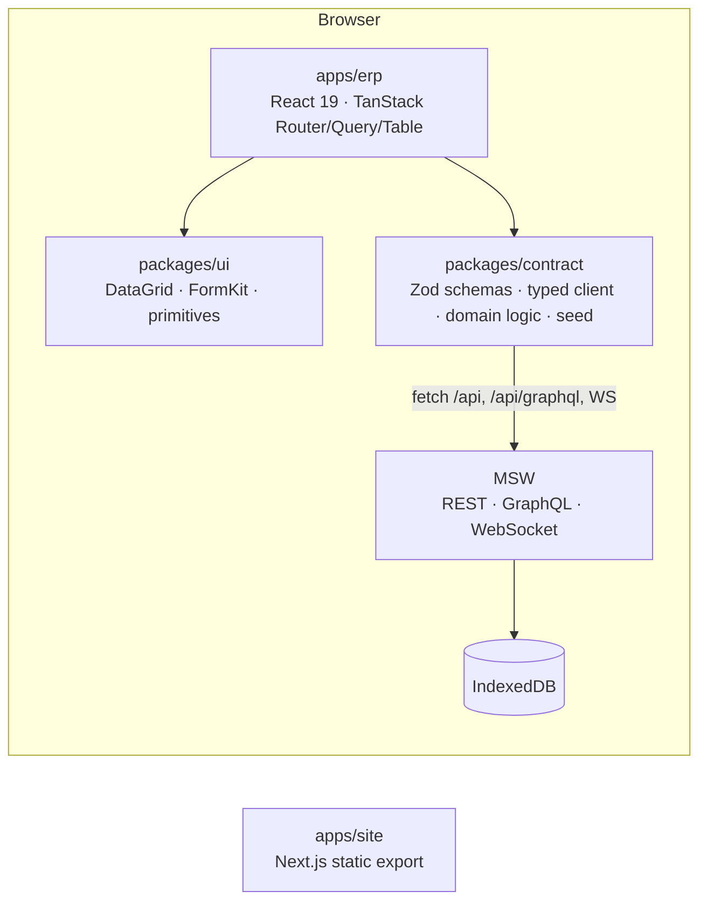

# Mekong ERP

A portfolio mini-ERP for a fictional Vietnamese FMCG trading company — **procure-to-pay,
order-to-cash, inventory, accounting-lite, and a configurable approval engine** — built to show how
I build data-heavy React front ends. The whole thing runs against a **mocked backend in the browser**
(MSW: REST + GraphQL + WebSocket, persisted to IndexedDB), so it needs no server.

[](https://github.com/HuyPhat/Mekong-ERP/actions/workflows/ci.yml)

**Live demo:** not deployed yet — see [Deploying](#deploying). Until then, run it locally in two
commands (below) and follow the [demo script](docs/DEMO_SCRIPT.md).


|                                                             |                                                                                 |
| ----------------------------------------------------------- | ------------------------------------------------------------------------------- |
|      |               |
|  |                  |
|  |  |

## Try it

```
nvm use && corepack enable
pnpm install
pnpm dev          # http://localhost:5173
```

The first visit seeds ~110,000 records into your browser's IndexedDB (a one-time wait behind a
"Preparing demo data…" splash; later loads take under a second). Pick any demo persona on the login
screen — no password. **User menu → Demo tools** resets the data and lets you simulate latency and
random failures.

## What is in it

- **Procure-to-pay** — 4-step PO wizard with autosaved drafts; amount-tiered approval chain;
  partial goods receipts; vendor bills with a three-way match, tolerance and a reasoned override;
  payment. ([workflow](docs/workflows/p2p.md))
- **Order-to-cash** — quotation → sales order → partial deliveries → invoice → payment, plus a
  print-ready Vietnamese **e-invoice preview** (a demo layout, not legal compliance).
  ([workflow](docs/workflows/o2c.md))
- **Approvals** — one inbox, filters, bulk approve, mandatory reject reason, document timeline,
  realtime toast. ([workflow](docs/workflows/approvals.md))
- **Inventory & DataGrid** — a reusable server-driven grid: URL-backed filters/sort/search, saved
  views, column pin/resize/visibility, CSV export and validated CSV import, and a **virtualized
  100,000-row** movements view.
- **Accounting-lite** — every document posts balanced journal entries to VAS-style accounts;
  general ledger, trial balance, AR/AP aging are computed from them
  ([ADR-0010](docs/adr/0010-general-ledger-and-aging-model.md)).
- **Dashboard & realtime** — GraphQL-backed KPIs and charts; a WebSocket feed toasts approvals and
  flashes changed stock rows.
- **RBAC & i18n** — eight personas with `resource:action` permissions gating routes, navigation and
  actions; Vietnamese by default, English one click away; light/dark theme.

## Architecture



Rules that shape the code (details in [`CLAUDE.md`](CLAUDE.md), rationale in
[`docs/PLAN.md`](docs/PLAN.md) and [`docs/adr/`](docs/adr)):

- Server state lives **only** in TanStack Query, keyed by per-entity factories.
- The **URL is the source of truth** for list views (Zod-validated search params).
- Every API response is parsed with **Zod** in `packages/contract`; errors normalize to
  `{ code, message, fieldErrors? }`.
- **Money is integer VND**, with rounding in one module.
- `packages/contract` is framework-agnostic (no React), so another framework could reuse it.
- Feature-sliced `apps/erp/src/features/*`; shared UI in `packages/ui`.

Architecture decision records: [0001 monorepo](docs/adr/0001-monorepo-tooling.md) ·
[0002 MSW as backend](docs/adr/0002-msw-as-backend.md) ·
[0003 money](docs/adr/0003-money-as-integer-vnd.md) ·
[0004 approval engine](docs/adr/0004-approval-engine-data-model.md) ·
[0005 three-way match](docs/adr/0005-three-way-match-tolerance-model.md) ·
[0006 SPA vs SSG](docs/adr/0006-rendering-strategy-split.md) ·
[0007 forms](docs/adr/0007-form-library.md) · [0008 client state](docs/adr/0008-client-ui-state.md) ·
[0009 hosting](docs/adr/0009-hosting-vercel.md) ·
[0010 ledger model](docs/adr/0010-general-ledger-and-aging-model.md).

## Job-requirement mapping

Status is stated plainly: **Done** = works and is covered as described; **Partial** = works with a
stated gap; **Not built** = not in this repository.

| Requirement                          | Where                                                                                                  | Status                                                                                              |
| ------------------------------------ | ------------------------------------------------------------------------------------------------------ | --------------------------------------------------------------------------------------------------- |
| ERP UIs: accounting, inventory, SCM  | Inventory, Purchasing, Sales, Accounting modules                                                       | Done (HRM not built)                                                                                |
| Multi-step forms                     | PO wizard with per-step validation and autosaved draft                                                 | Done                                                                                                |
| Approval flows                       | Approval engine, inbox, timeline ([ADR-0004](docs/adr/0004-approval-engine-data-model.md))             | Done                                                                                                |
| Financial dashboards                 | Revenue/COGS trend, gross margin, cash, AR/AP aging                                                    | Done                                                                                                |
| Real-time reporting tables           | WebSocket feed; stock row flash and "Live" badge                                                       | Done (same-tab only)                                                                                |
| GL / AR / AP, P2P, O2C, inventory    | Balanced postings; ledger, trial balance, aging                                                        | Done                                                                                                |
| REST / GraphQL / WebSocket           | MSW handlers for all three                                                                             | Done (GraphQL: one dashboard query by design)                                                       |
| Reusable components, FE architecture | `packages/ui` DataGrid + FormKit; feature-sliced app                                                   | Done                                                                                                |
| Performance                          | Server pagination; 100k-row virtualization; route code-splitting; initial-bundle budget enforced in CI | Done                                                                                                |
| Responsive design                    | Desktop-first dense layouts                                                                            | Partial (not systematically tuned for phones)                                                       |
| Frontend security                    | Route guards, strict CSP + headers, no raw HTML, CSV formula sanitization, [SECURITY.md](SECURITY.md)  | Done (client RBAC is UX only, stated)                                                               |
| TypeScript, Tailwind, SCSS           | TS strict; Tailwind v4; one SCSS module (invoice print styles)                                         | Done                                                                                                |
| Git, CI/CD, Docker                   | GitHub Actions (lint, types, tests, coverage, e2e, budget, image build); Dockerfile + nginx            | Done (the image builds and passes a container header smoke test in CI; see [Deploying](#deploying)) |
| SSR/SSG (Next.js), SEO               | `apps/site`: static export, metadata, sitemap, robots, OG image                                        | Done                                                                                                |
| Unit testing                         | Vitest across three packages; Playwright e2e; axe checks                                               | Done                                                                                                |
| Vue.js                               | —                                                                                                      | Not built (stretch)                                                                                 |
| Micro frontend                       | `packages/contract` is framework-agnostic; no MFE shell                                                | Partial (groundwork only)                                                                           |
| VAS localization                     | VAS account codes, VND, vi-VN formats, VAT 0/5/8/10, mock e-invoice                                    | Done                                                                                                |
| Collaboration with BA / QA           | [`docs/workflows`](docs/workflows) user stories and diagrams                                           | Done (no Storybook)                                                                                 |

## Quality

| Check                 | Result                                                                                                                                                                                                                                                                                                                                                |
| --------------------- | ----------------------------------------------------------------------------------------------------------------------------------------------------------------------------------------------------------------------------------------------------------------------------------------------------------------------------------------------------- |
| Unit tests            | 150 tests across `packages/contract`, `packages/ui`, `apps/erp` (`pnpm test`)                                                                                                                                                                                                                                                                         |
| Domain-logic coverage | 99% of lines (98% of statements, 94% of branches) in the pure domain modules (approval engine, three-way match, ledger, money, list-query, …), thresholds enforced in CI. Scope is listed in [`packages/contract/vitest.config.ts`](packages/contract/vitest.config.ts); handlers, seed data and thin clients are covered by e2e rather than counted. |
| End-to-end            | 27 Playwright specs on the **production build** served with the real security headers: login/RBAC, full P2P and O2C flows, dashboard, grid, demo tools. Every spec fails on any console error, page error or CSP violation.                                                                                                                           |
| Accessibility         | axe-core (WCAG 2.0/2.1 A + AA) on login and five key screens, plus dark mode and the two searchable dialogs (command palette, record pickers)                                                                                                                                                                                                         |
| Initial bundle        | 273 kB JS + 6 kB CSS gzipped for the initial load (budget 300 kB / 20 kB; enforced by `pnpm --filter @mekong-erp/erp budget`; seed generators are lazy-loaded)                                                                                                                                                                                        |
| Lighthouse            | Lighthouse 13.5, desktop preset, local production builds, warm profile: the app scores 98–99 performance and 100 accessibility, best practices and SEO on the login, dashboard and products pages; the static site scores 100 in all four categories. Not measured on the mobile preset or on a hosted deployment.                                    |

```
pnpm format:check && pnpm lint && pnpm typecheck && pnpm test && pnpm build
pnpm test:e2e        # builds, then runs Playwright against `vite preview`
```

## Deploying

Nothing is deployed yet, so there is no live URL to link:

- **Vercel** (per [ADR-0009](docs/adr/0009-hosting-vercel.md)) — configured but **never exercised**: a
  deployment needs an account this repository's automation doesn't have. Create two projects from this
  repo with root directories `apps/erp` and `apps/site`. Each has a `vercel.json` (install/build
  commands, SPA rewrite, security headers). For the site, set `NEXT_PUBLIC_SITE_URL` (canonical, sitemap
  and OG URLs) and `NEXT_PUBLIC_DEMO_URL` (enables the "Live demo" links). The install and build
  commands mirror what CI runs, but they have not been run on Vercel.
- **Docker** — `docker compose up --build` serves the ERP build via unprivileged nginx on
  `http://localhost:8080` with the same headers. The authoring machine had no Docker daemon; the image is
  built and smoke-tested (headers and SPA fallback) by a CI job on every push, and passed there.

## Repository layout

```
apps/erp        React 19 SPA (routes, features, e2e, security headers)
apps/site       Next.js static site: landing, case study, architecture
packages/ui     Design-system components, DataGrid, FormKit
packages/contract  Zod schemas, typed client, MSW handlers, seed, pure domain logic
packages/config Shared ESLint / TypeScript config
docs/           PLAN, ADRs, workflows, demo script, screenshots
```

## Known limitations

Stated up front rather than discovered later:

- The backend is a mock; **client-side RBAC is UX, not authorization** ([SECURITY.md](SECURITY.md)).
- The e-invoice is a demo layout, not compliant e-invoicing.
- Ledger reports recompute from all journal entries on each request (fine at this scale;
  [ADR-0010](docs/adr/0010-general-ledger-and-aging-model.md)).
- Realtime is same-tab only; there is no cross-tab sync.
- Grid keyboard support covers individual controls, not full arrow-key cell navigation; column
  drag-reorder has state but no drag handle UI.
- A `changes_requested` PO is resubmitted as-is rather than re-opened in the wizard.
- Catalog comboboxes filter in memory (fine for 3,000 products, not for real catalogs).
- Not built: Vue app, HRM module, Storybook, XLSX export.

## License

[MIT](LICENSE)
