# Mekong ERP

A portfolio mini-ERP for a fictional Vietnamese FMCG trading company — **procure-to-pay,
order-to-cash, inventory, accounting-lite, HR leave requests, and a configurable approval engine** —
built to show how I build data-heavy React front ends, plus a Vue 3 approvals inbox on the same API
contract. The whole thing runs against a **mocked backend in the browser** (MSW: REST + GraphQL +
WebSocket, persisted to IndexedDB), so it needs no server.

[](https://github.com/HuyPhat/Mekong-ERP/actions/workflows/ci.yml)

**Live demo:** not deployed yet — see [Deploying](#deploying). Until then, run it locally in two
commands (below) and follow the [demo script](docs/DEMO_SCRIPT.md).

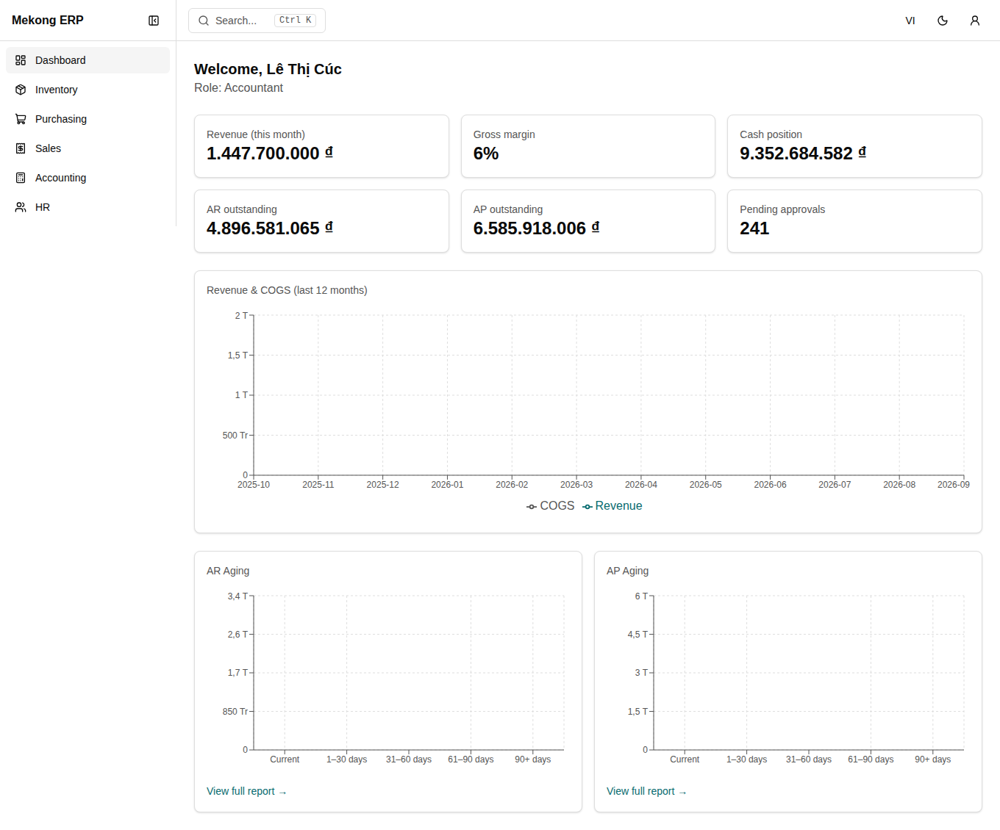

|                                                                   |                                                                                     |
| ----------------------------------------------------------------- | ----------------------------------------------------------------------------------- |
| 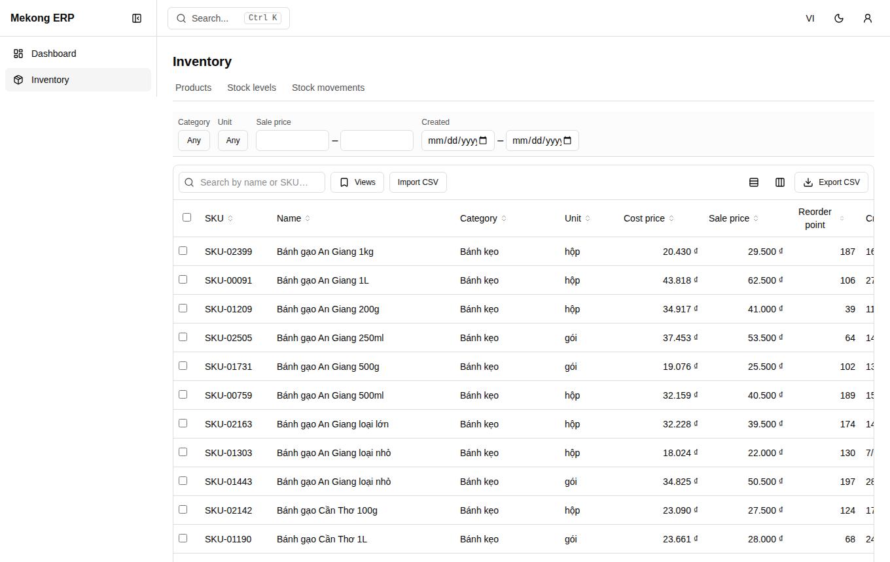           | 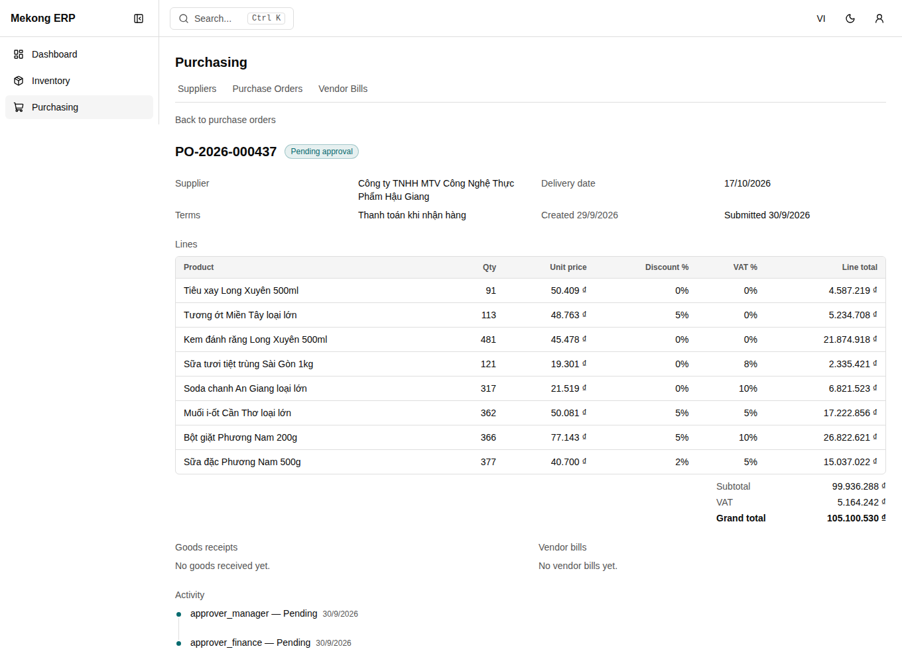                  |
| 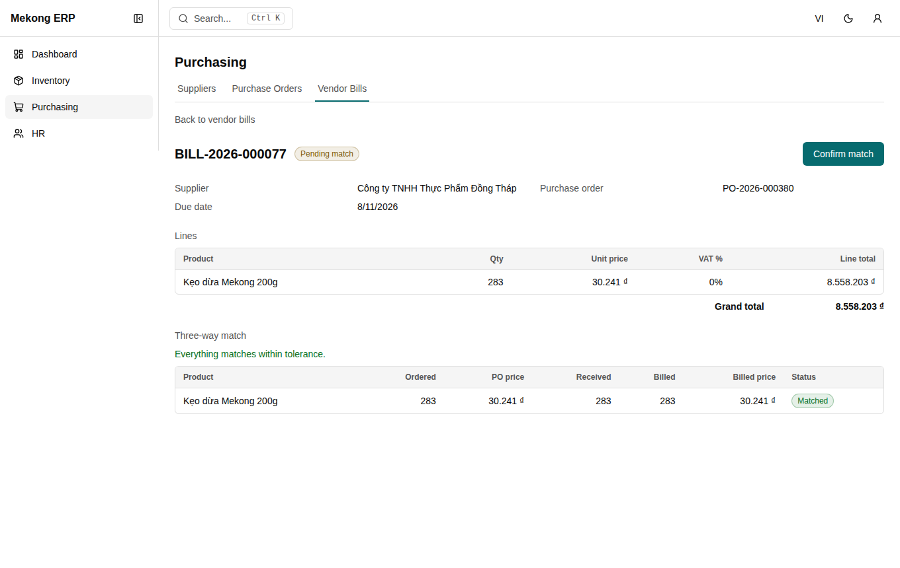       | 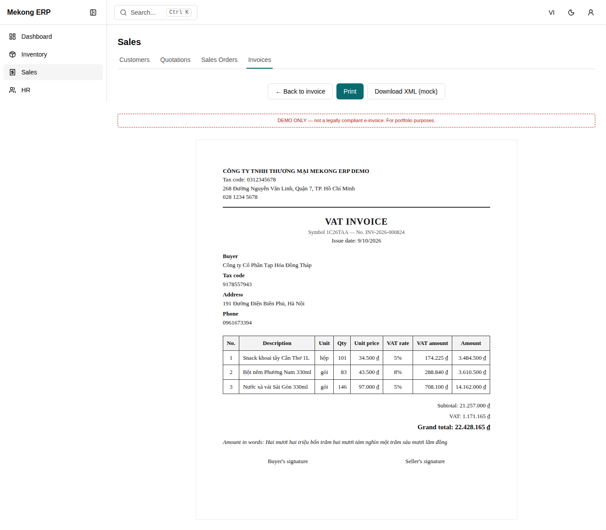                     |
| 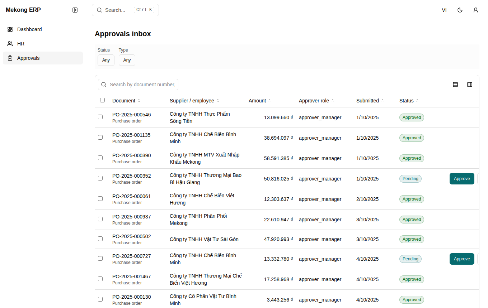       | 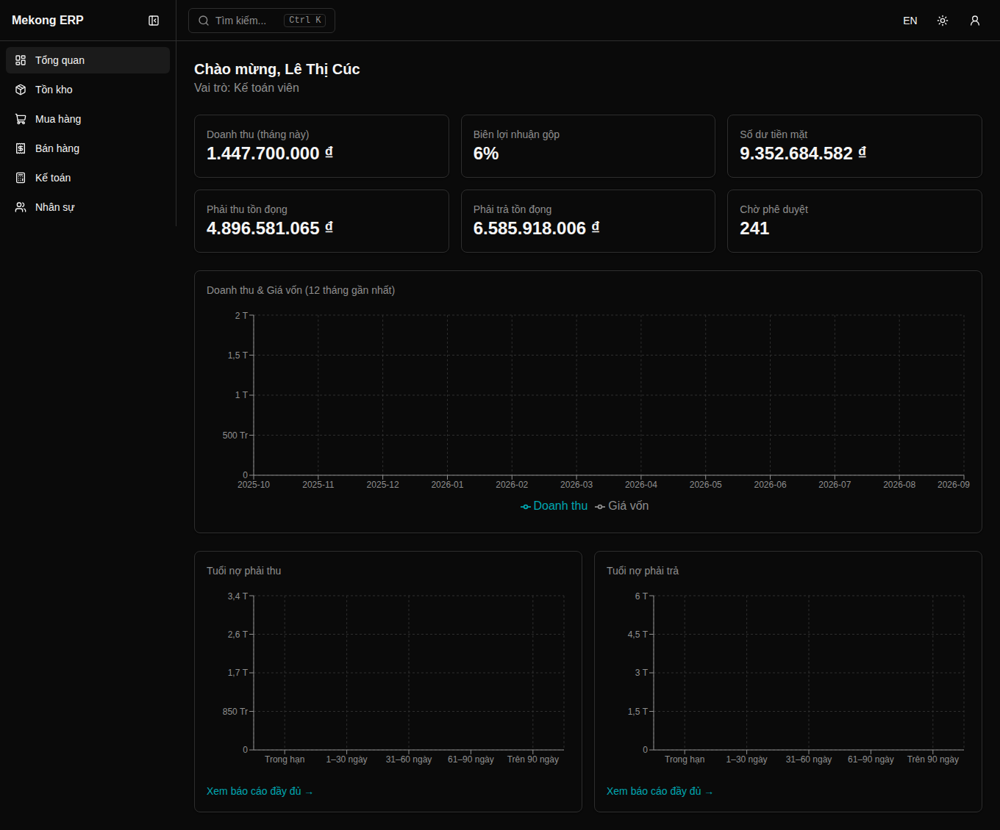     |
| 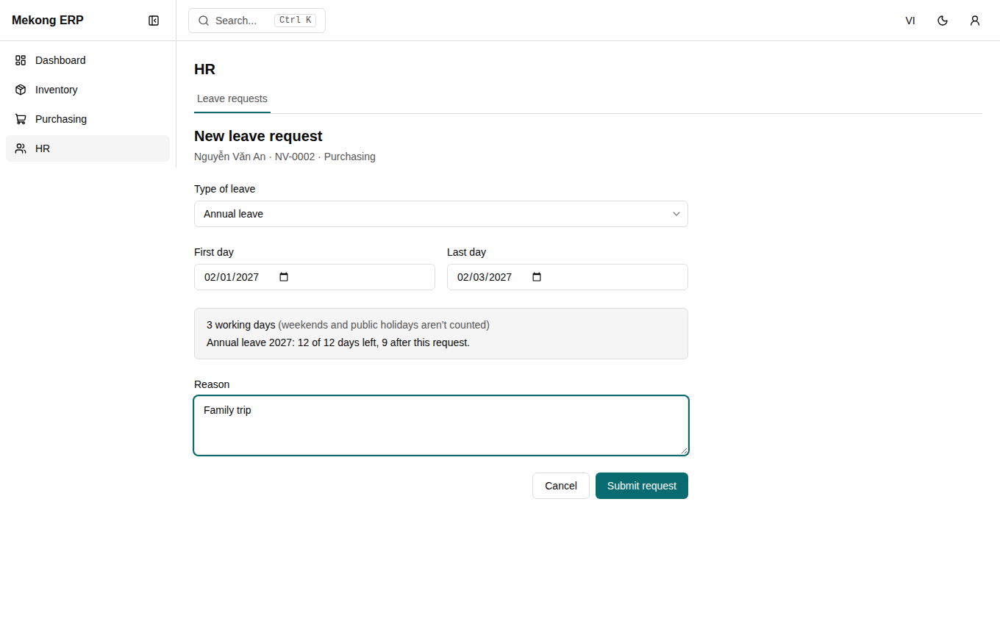 | 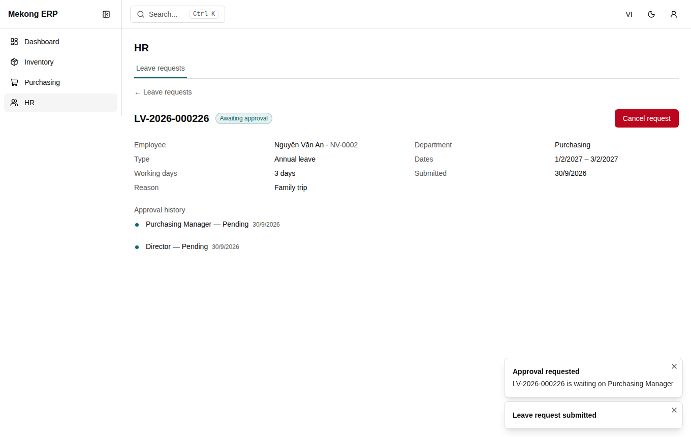 |
| 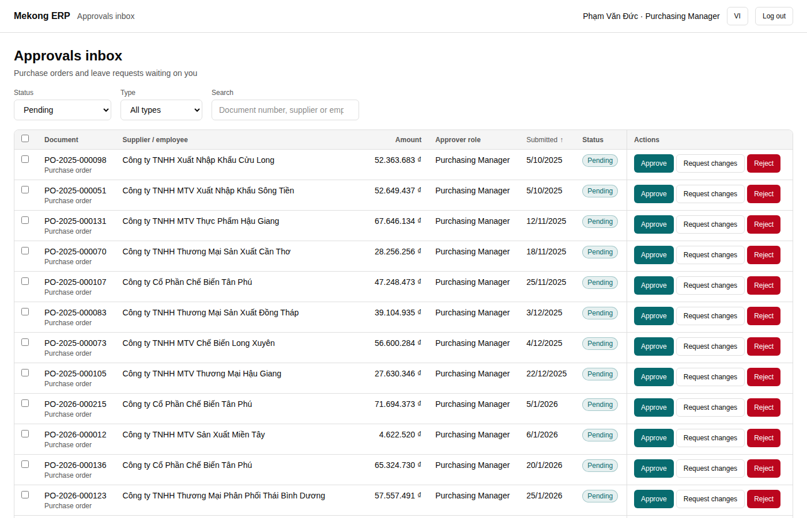         | 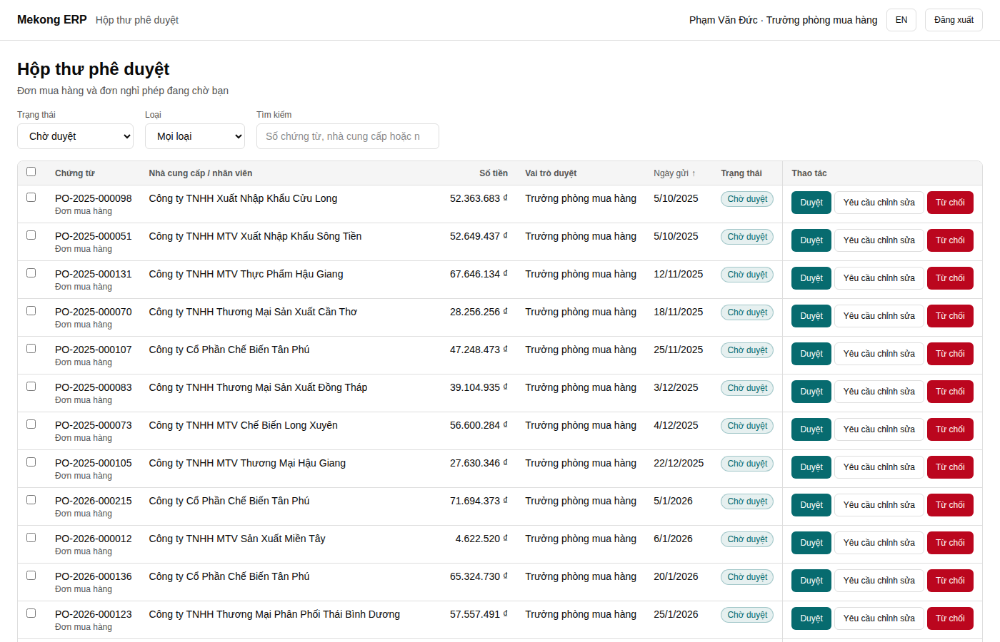              |

## Try it

```
nvm use && corepack enable
pnpm install
pnpm dev          # http://localhost:5173
```

The first visit seeds ~110,000 records into your browser's IndexedDB (a one-time wait behind a
"Preparing demo data…" splash; later loads take under a second). Pick any demo persona on the login
screen — no password. **User menu → Demo tools** resets the data and lets you simulate latency and
random failures.

```
pnpm --filter @mekong-erp/erp-vue dev    # the Vue approvals inbox, http://localhost:5174
pnpm --filter @mekong-erp/ui storybook   # the component library, http://localhost:6006
```

The Vue app is a separate origin with its own (much smaller, ~2,400-record) demo dataset, so it
starts in about a second.

## What is in it

- **Procure-to-pay** — 4-step PO wizard with autosaved drafts; amount-tiered approval chain;
  partial goods receipts; vendor bills with a three-way match, tolerance and a reasoned override;
  payment. ([workflow](docs/workflows/p2p.md))
- **Order-to-cash** — quotation → sales order → partial deliveries → invoice → payment, plus a
  print-ready Vietnamese **e-invoice preview** (a demo layout, not legal compliance).
  ([workflow](docs/workflows/o2c.md))
- **Approvals** — one inbox for purchase orders and leave, filters, bulk approve, mandatory reject
  reason, document timeline with one round per submission, realtime toast.
  ([workflow](docs/workflows/approvals.md))
- **HR leave requests** — request leave with a live working-day and balance preview; the same
  approval engine routes it (1–2 days to a manager, 3+ to a manager then a director); balances are
  computed, not stored; nobody decides their own request; send back, edit and resubmit.
  ([workflow](docs/workflows/leave.md), [ADR-0015](docs/adr/0015-leave-requests-on-the-approval-engine.md))
- **Vue 3 approvals inbox** (`apps/erp-vue`) — the same inbox rebuilt in Vue on the shared
  contract, with its own tests. A separate app, not a composed micro frontend
  ([ADR-0016](docs/adr/0016-vue-approvals-inbox-on-the-shared-contract.md)).
- **Inventory & DataGrid** — a reusable server-driven grid: URL-backed filters/sort/search, saved
  views, column pin/resize/visibility, CSV export and validated CSV import, **Excel export** (a real
  `.xlsx` with typed cells, written without a library so it works under the strict CSP —
  [ADR-0013](docs/adr/0013-xlsx-export-without-a-library.md)), and a **virtualized 100,000-row**
  movements view.
- **Accounting-lite** — every document posts balanced journal entries to VAS-style accounts;
  general ledger, trial balance, AR/AP aging are computed from them
  ([ADR-0010](docs/adr/0010-general-ledger-and-aging-model.md)).
- **Dashboard & realtime** — GraphQL-backed KPIs and charts; a WebSocket feed toasts approvals and
  flashes changed stock rows.
- **RBAC & i18n** — eight personas with `resource:action` permissions gating routes, navigation and
  actions; Vietnamese by default, English one click away; light/dark theme.
- **Storybook** — 53 stories for `packages/ui` on the shared design tokens, every one checked in CI
  for console errors and axe A/AA violations in light and dark
  ([ADR-0014](docs/adr/0014-storybook-and-shared-design-tokens.md)). Built in CI, not published.

## Architecture

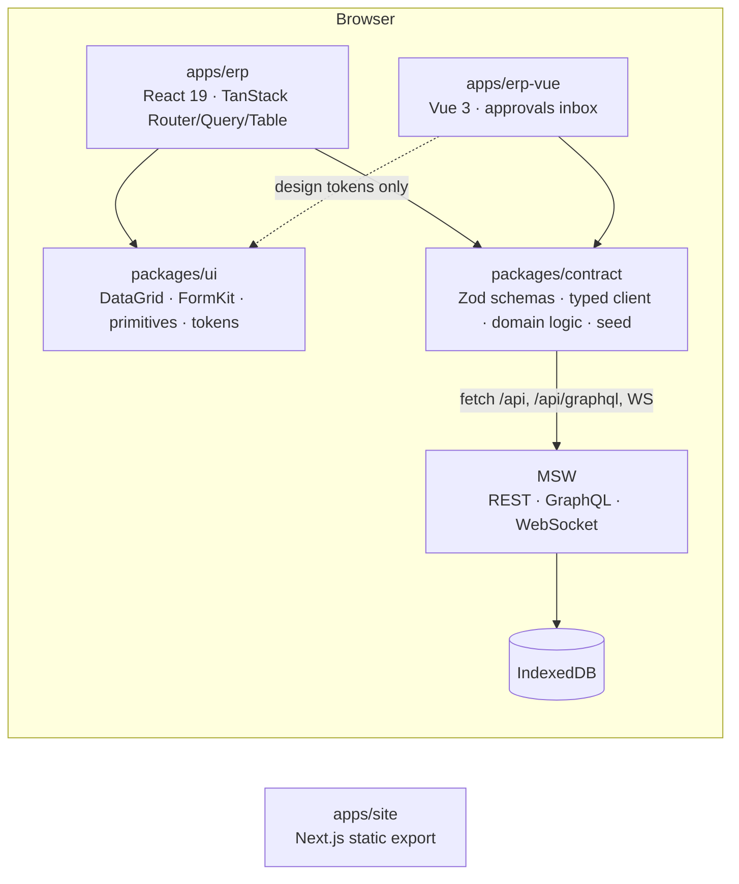

Rules that shape the code (details in [`CLAUDE.md`](CLAUDE.md), rationale in
[`docs/PLAN.md`](docs/PLAN.md) and [`docs/adr/`](docs/adr)):

- Server state lives **only** in TanStack Query, keyed by per-entity factories.
- The **URL is the source of truth** for list views (Zod-validated search params).
- Every API response is parsed with **Zod** in `packages/contract`; errors normalize to
  `{ code, message, fieldErrors? }`.
- **Money is integer VND**, with rounding in one module.
- `packages/contract` is framework-agnostic (no React) — and the Vue inbox proves it: it parses the
  same schemas and calls the same typed client.
- Feature-sliced `apps/erp/src/features/*`; shared UI in `packages/ui`.

Architecture decision records: [0001 monorepo](docs/adr/0001-monorepo-tooling.md) ·
[0002 MSW as backend](docs/adr/0002-msw-as-backend.md) ·
[0003 money](docs/adr/0003-money-as-integer-vnd.md) ·
[0004 approval engine](docs/adr/0004-approval-engine-data-model.md) ·
[0005 three-way match](docs/adr/0005-three-way-match-tolerance-model.md) ·
[0006 SPA vs SSG](docs/adr/0006-rendering-strategy-split.md) ·
[0007 forms](docs/adr/0007-form-library.md) · [0008 client state](docs/adr/0008-client-ui-state.md) ·
[0009 hosting](docs/adr/0009-hosting-vercel.md) ·
[0010 ledger model](docs/adr/0010-general-ledger-and-aging-model.md) ·
[0011 e2e and a11y testing](docs/adr/0011-end-to-end-and-accessibility-testing.md) ·
[0012 security headers](docs/adr/0012-security-headers-single-source.md) ·
[0013 XLSX export](docs/adr/0013-xlsx-export-without-a-library.md) ·
[0014 Storybook and tokens](docs/adr/0014-storybook-and-shared-design-tokens.md) ·
[0015 leave requests](docs/adr/0015-leave-requests-on-the-approval-engine.md) ·
[0016 Vue inbox](docs/adr/0016-vue-approvals-inbox-on-the-shared-contract.md).

## Job-requirement mapping

Status is stated plainly: **Done** = works and is covered as described; **Partial** = works with a
stated gap; **Not built** = not in this repository.

| Requirement                          | Where                                                                                                  | Status                                                                                              |
| ------------------------------------ | ------------------------------------------------------------------------------------------------------ | --------------------------------------------------------------------------------------------------- |
| ERP UIs: accounting, inventory, SCM  | Inventory, Purchasing, Sales, Accounting modules                                                       | Done                                                                                                |
| HRM                                  | Leave requests on the approval engine ([workflow](docs/workflows/leave.md))                            | Partial (leave only: no payroll, attendance or org chart)                                           |
| Multi-step forms                     | PO wizard with per-step validation and autosaved draft                                                 | Done                                                                                                |
| Approval flows                       | Approval engine, inbox, timeline ([ADR-0004](docs/adr/0004-approval-engine-data-model.md))             | Done                                                                                                |
| Financial dashboards                 | Revenue/COGS trend, gross margin, cash, AR/AP aging                                                    | Done                                                                                                |
| Real-time reporting tables           | WebSocket feed; stock row flash and "Live" badge                                                       | Done (same-tab only)                                                                                |
| GL / AR / AP, P2P, O2C, inventory    | Balanced postings; ledger, trial balance, aging                                                        | Done                                                                                                |
| REST / GraphQL / WebSocket           | MSW handlers for all three                                                                             | Done (GraphQL: one dashboard query by design)                                                       |
| Reusable components, FE architecture | `packages/ui` DataGrid + FormKit; feature-sliced app; Excel and CSV export from one column list        | Done                                                                                                |
| Performance                          | Server pagination; 100k-row virtualization; route code-splitting; initial-bundle budget enforced in CI | Done                                                                                                |
| Responsive design                    | Desktop-first dense layouts                                                                            | Partial (not systematically tuned for phones)                                                       |
| Frontend security                    | Route guards, strict CSP + headers, no raw HTML, CSV formula sanitization, [SECURITY.md](SECURITY.md)  | Done (client RBAC is UX only, stated)                                                               |
| TypeScript, Tailwind, SCSS           | TS strict; Tailwind v4; one SCSS module (invoice print styles)                                         | Done                                                                                                |
| Git, CI/CD, Docker                   | GitHub Actions (lint, types, tests, coverage, e2e, budget, image build); Dockerfile + nginx            | Done (the image builds and passes a container header smoke test in CI; see [Deploying](#deploying)) |
| SSR/SSG (Next.js), SEO               | `apps/site`: static export, metadata, sitemap, robots, OG image                                        | Done                                                                                                |
| Unit testing                         | Vitest across four packages; Playwright e2e for both apps; axe checks                                  | Done                                                                                                |
| Vue.js                               | `apps/erp-vue`: Vue 3 approvals inbox on the shared contract, own unit and e2e tests                   | Done (one screen, not a second ERP; its own demo data)                                              |
| Micro frontend                       | Shared contract, tokens and CSP across React and Vue apps; no shell composing them at run time         | Partial (independent apps sharing packages — not a run-time micro frontend)                         |
| VAS localization                     | VAS account codes, VND, vi-VN formats, VAT 0/5/8/10, mock e-invoice                                    | Done                                                                                                |
| Collaboration with BA / QA / design  | [`docs/workflows`](docs/workflows) user stories and diagrams; Storybook for `packages/ui`              | Done (Storybook is built and tested in CI, not hosted)                                              |

## Quality

The tests, coverage and bundle numbers were measured on 2026-10-01 from the commit that carries them; the Lighthouse scores on 2026-09-30, before the last small inbox changes.

| Check                 | Result                                                                                                                                                                                                                                                                                                                                                                                                                                     |
| --------------------- | ------------------------------------------------------------------------------------------------------------------------------------------------------------------------------------------------------------------------------------------------------------------------------------------------------------------------------------------------------------------------------------------------------------------------------------------ |
| Unit tests            | 303 tests: `packages/contract` 180, `packages/ui` 47, `apps/erp-vue` 49, `apps/erp` 27 (`pnpm test`)                                                                                                                                                                                                                                                                                                                                       |
| Domain-logic coverage | 99.3% of lines (98.8% of statements, 95.6% of branches) in the pure domain modules (approval engine, three-way match, ledger, leave rules, money, list-query, …), thresholds enforced in CI. Scope is listed in [`packages/contract/vitest.config.ts`](packages/contract/vitest.config.ts); handlers, seed data and thin clients are covered by e2e rather than counted.                                                                   |
| End-to-end            | 41 Playwright specs for the React app and 15 for the Vue inbox, all on the **production build** served with the real security headers: login/RBAC, full P2P and O2C flows, the leave flows, dashboard, grid and Excel export, demo tools. Every spec fails on any console error, page error or CSP violation. Both suites pass on CI at the head: the React one takes about 9 minutes there (12–14 locally), the Vue one about 30 seconds. |
| Accessibility         | axe-core (WCAG 2.0/2.1 A + AA): 13 checks on the React app (login, seven screens, the leave form and request page, the dark dashboard, the two searchable dialogs), 5 on the Vue inbox, and every Storybook story in light and dark                                                                                                                                                                                                        |
| Initial bundle        | React app 279.1 kB JS + 5.7 kB CSS gzipped for the initial load (budget 300 kB / 20 kB); Vue inbox 82.6 kB + 4.4 kB (budget 150 kB / 20 kB). Both enforced in CI by `pnpm --filter <app> budget`; the seed generators are lazy-loaded                                                                                                                                                                                                      |
| Lighthouse            | Lighthouse 13.5, desktop preset, local production builds, warm profile: the React app scores 97–99 performance and 100 accessibility, best practices and SEO on the login, dashboard, products, approvals and leave pages; the static site scores 100 in all four categories on its three pages. Not measured on the mobile preset, on a hosted deployment, or on the Vue app.                                                             |

```
pnpm format:check && pnpm lint && pnpm typecheck && pnpm test && pnpm build
pnpm test:e2e        # builds, then runs Playwright against `vite preview`
pnpm test:e2e:vue    # builds apps/erp-vue, then runs its Playwright suite
```

## Deploying

Nothing is deployed yet, so there is no live URL to link:

- **Vercel** (per [ADR-0009](docs/adr/0009-hosting-vercel.md)) — configured but **never exercised**: a
  deployment needs an account this repository's automation doesn't have. Create two projects from this
  repo with root directories `apps/erp` and `apps/site`. Each has a `vercel.json` (install/build
  commands, SPA rewrite, security headers). For the site, set `NEXT_PUBLIC_SITE_URL` (canonical, sitemap
  and OG URLs) and `NEXT_PUBLIC_DEMO_URL` (enables the "Live demo" links). The install and build
  commands mirror what CI runs, but they have not been run on Vercel.
- **Vue inbox and Storybook** — not deployed either. `apps/erp-vue` has its own `vercel.json` (a
  copy of the React app's, covered by the same headers drift test) and would be a third project with
  root directory `apps/erp-vue`; it has never run on Vercel. CI builds the static Storybook and uploads
  it as an artifact; hosting it is an owner step.
- **Docker** — `docker compose up --build` serves the ERP build via unprivileged nginx on
  `http://localhost:8080` with the same headers. The authoring machine had no Docker daemon; the image is
  built and smoke-tested (headers and SPA fallback) by a CI job on every push, and passed there.

## Repository layout

```
apps/erp        React 19 SPA (routes, features, e2e, security headers)
apps/erp-vue    Vue 3 approvals inbox on the shared contract (own e2e, own demo data)
apps/site       Next.js static site: landing, case study, architecture
packages/ui     Design-system components, DataGrid, FormKit, design tokens, Storybook
packages/contract  Zod schemas, typed client, MSW handlers, seed, pure domain logic
packages/config Shared ESLint / TypeScript config
docs/           PLAN, ADRs, workflows, demo script, screenshots
```

## Known limitations

Stated up front rather than discovered later:

- The backend is a mock; **client-side RBAC is UX, not authorization** ([SECURITY.md](SECURITY.md)).
- The e-invoice is a demo layout, not compliant e-invoicing.
- Ledger reports recompute from all journal entries on each request (fine at this scale;
  [ADR-0010](docs/adr/0010-general-ledger-and-aging-model.md)).
- Realtime is same-tab only; there is no cross-tab sync.
- Grid keyboard support covers individual controls, not full arrow-key cell navigation; column
  drag-reorder has state but no drag handle UI.
- A `changes_requested` PO is resubmitted as-is rather than re-opened in the wizard (a leave request
  _is_ edited and resubmitted).
- Leave is a slice of HR, not a module: a flat 12-day allowance (no accrual or carry-over), whole days
  only, weekdays minus four fixed public holidays (lunar holidays like Tết are not modelled), approvers
  by role rather than reporting line, no payroll or attendance.
- The approvals inbox still lists a step that is queued behind an earlier approver (it says "Waiting on
  an earlier approval" and offers no buttons); a stale tab that tries to decide one is refused with a 409.
  Its Actions column is pinned to the right edge, so on a narrower screen the other columns scroll
  beneath it.
- The Vue app is a separate origin with its own demo data and login, has no realtime feed, and
  covers the inbox only. The React and Vue apps do not compose at run time.
- The `.xlsx` export was read back with two independent readers (openpyxl and SheetJS) but **not
  opened in desktop Excel**. Storybook is built and checked in CI but not hosted.
- Catalog comboboxes filter in memory (fine for 3,000 products, not for real catalogs).
- Not built: saved report builder and offline drafts (the remaining PLAN §8 Phase 6 items).

## License

[MIT](LICENSE)
