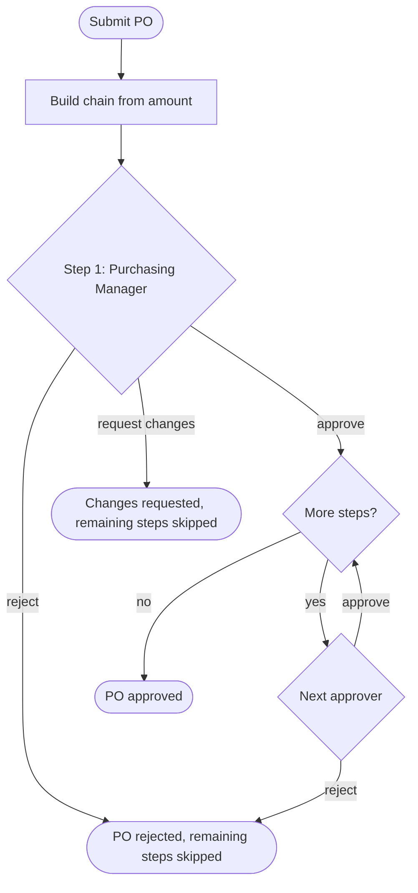

# Approvals

## User stories

- As an **approver**, I see only the approvals that are waiting on my role.
- As an **approver**, I can approve, reject (mandatory reason) or request changes.
- As a **submitter**, I see the whole approval chain on the document's timeline.
- As **anyone with a document open**, I get a toast when an approval is requested.
- As an **approver**, I never decide my own leave request (`403 SELF_DECISION`).
- As an **approver**, I see a step that is queued behind an earlier approver (the director's, while the
  manager hasn't decided) marked "Waiting on an earlier approval", with no buttons until its turn.

## How a chain is built

Rules are keyed by document type and amount threshold and are **cumulative**: a higher
tier adds approvers on top of the lower ones. The "amount" is the document's magnitude: VND for a
purchase order, working days for [leave](leave.md). The default PO rules:

| PO total (VND)       | Approval chain                                  |
| -------------------- | ----------------------------------------------- |
| under 50,000,000     | Purchasing Manager                              |
| 50,000,000 and over  | Purchasing Manager → Finance Manager            |
| 500,000,000 and over | Purchasing Manager → Finance Manager → Director |

The whole chain is materialised when the document is submitted, so later rule edits do not
change an in-flight approval. When a document is sent back and resubmitted it gets a **new**
chain; the newest submission decides the outcome, and the older steps stay on the timeline as
history (one round at a time).

Decisions are audited (who, what, when). See
[ADR-0004](../adr/0004-approval-engine-data-model.md).
