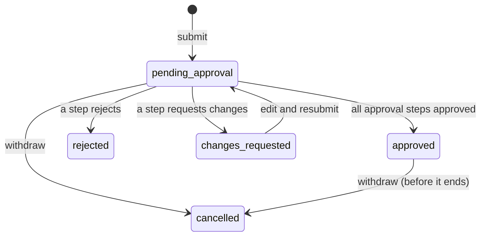

# Leave requests

The second document to run on the [approval engine](approvals.md). Screens live under
**HR → Leave**; the same inbox is also available as a standalone Vue app
([ADR-0016](../adr/0016-vue-approvals-inbox-on-the-shared-contract.md)). Rationale in
[ADR-0015](../adr/0015-leave-requests-on-the-approval-engine.md).

## User stories

- As an **employee**, I request leave for a date range and see, before I send it, how many
  working days it is and what my balance will be afterwards.
- As an **employee**, I see my balance (allowance, used, pending, remaining) and my own requests.
- As an **employee**, I withdraw a request that is pending or approved and has not ended yet.
- As an **employee**, when a request is sent back for changes I edit it and resubmit it: it keeps
  its number and gets a new approval chain, and the old steps stay on the timeline as history.
- As a **manager** or **director**, I decide leave from the same approvals inbox as purchase
  orders — approve, reject (reason required) or request changes.
- As an **approver**, I cannot decide my own request.
- As **anyone**, I can see who is away and when (**Everyone's leave**).

## Leave status

There is no draft state: a request exists once it is submitted.

## Who approves

The rules are the engine's, keyed by document type and amount range; for leave the "amount" is
**working days**.

| Working days | Approval chain     |
| ------------ | ------------------ |
| 1–2          | Manager            |
| 3 or more    | Manager → Director |

Approvers are **roles**, not people: anyone holding the role can decide. There are no reporting
lines in the data. The one exception is the self-decision guard: when the actor is the requester
the handler answers `403 SELF_DECISION`, so a manager's own request waits at the manager step until
someone else decides it (in the demo, the admin login, which sees every step).

## What the server checks

The form previews the numbers, but the handler enforces the rules and answers with field-level
errors, so a stale or hand-made request can't get around them:

- End date not before start date; the range must contain at least one working day; both dates in
  the same calendar year; a reason is required.
- **Working days** = weekdays minus four fixed public holidays (1 Jan, 30 Apr, 1 May, 2 Sep). The
  lunar-calendar holidays and substitute days off are not modelled.
- `409 LEAVE_OVERLAP` naming the request in the way (pending and approved requests count).
- `422 INSUFFICIENT_BALANCE`: annual leave draws on a 12-day allowance; sick, unpaid and special
  leave do not. **Pending days are held**, so two requests can't both spend the last days.
- `422 NO_APPROVAL_RULE` if no rule covers the length.

## Balances

Computed from the requests, never stored: used = approved annual days, pending = annual days still
awaiting a decision, remaining = allowance − used − pending. A number recomputed from its source
can't drift from it (the same idea as [ADR-0010](../adr/0010-general-ledger-and-aging-model.md)).

## Known simplifications

A flat allowance for everyone (no accrual by tenure, no carry-over), whole days only (no
half-days), no leave-type-specific rules such as a sick note, roles instead of reporting lines, and
no lunar holidays. Each would be a rule the pure `packages/contract/src/leave.ts` module takes
without the engine changing.
