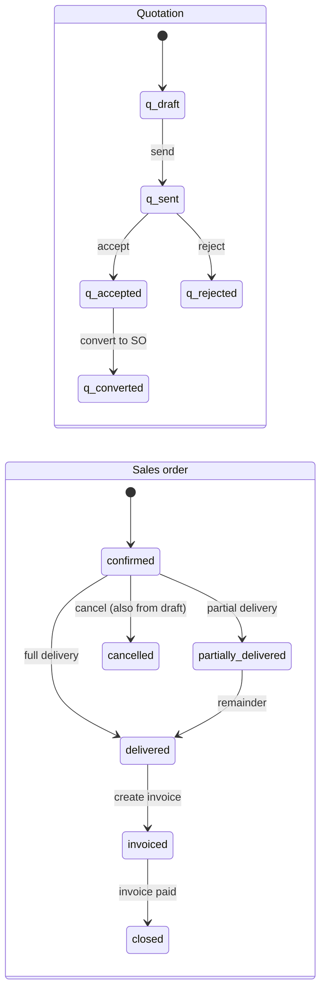

# Order-to-Cash

## User stories

- As **sales**, I draft a quotation for a customer, send it, and record acceptance.
- As **sales**, I convert an accepted quotation into a sales order in one click.
- As **warehouse/sales**, I deliver an order in several partial deliveries.
- As **sales/accountant**, I invoice a delivered order, print or preview a Vietnamese
  e-invoice (demo layout only), and record the customer's payment.
- As an **accountant**, I see the resulting ledger, trial balance and AR aging.

## Status machines

A quotation can also be `expired`, but that status exists only in seeded data — nothing expires quotations automatically.

Invoice status is `unpaid` → `paid`. "Overdue" is derived from the due date, never stored.

## Postings

| Event            | Journal entry                                            |
| ---------------- | -------------------------------------------------------- |
| Delivery         | Dr 632 COGS / Cr 156 Merchandise                         |
| Customer invoice | Dr 131 Receivables / Cr 511 Revenue + Cr 3331 Output VAT |
| Customer payment | Dr 112 Bank / Cr 131 Receivables                         |

COGS books at delivery and revenue at invoicing, mirroring the P2P split between goods
receipt and vendor bill. See [ADR-0010](../adr/0010-general-ledger-and-aging-model.md).
