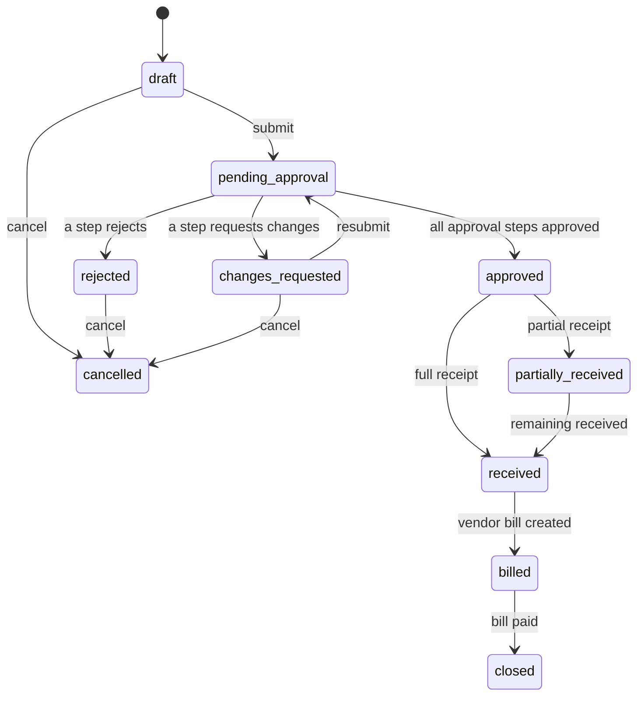

# Procure-to-Pay

## User stories

- As **purchasing**, I create a purchase order through a four-step wizard (supplier →
  lines → delivery & terms → review), and my in-progress draft survives a reload.
- As **purchasing**, I submit the PO and see who has to approve it and where it is stuck.
- As an **approver**, I approve, reject (with a mandatory reason) or request changes from
  one inbox, singly or in bulk.
- As **warehouse**, I receive goods against an approved PO, partially and more than once.
- As an **accountant**, I record a vendor bill against the PO, see it matched line by line
  against what was ordered and received, and either confirm it or override an exception
  with a reason (if I hold `vendor_bill:override_match`).
- As an **accountant**, I record payment and the PO closes.

## PO status

## Postings

| Event         | Journal entry                                                                                   |
| ------------- | ----------------------------------------------------------------------------------------------- |
| Goods receipt | Dr 156 Merchandise / Cr 331 Payables                                                            |
| Vendor bill   | Dr 1331 Input VAT / Cr 331 Payables (VAT only — the goods value was already accrued at receipt) |
| Payment       | Dr 331 Payables / Cr 112 Bank                                                                   |

## Three-way match

Ordered vs cumulative received vs billed, per line, with a configurable tolerance
(default 2% on price, exact quantity). Status priority: not received → quantity variance →
price variance → matched. An unresolved exception blocks "confirm match" unless overridden
with a reason. Bill status is `pending_match` → `matched` (or `match_override`) → `paid`. See [ADR-0005](../adr/0005-three-way-match-tolerance-model.md).
